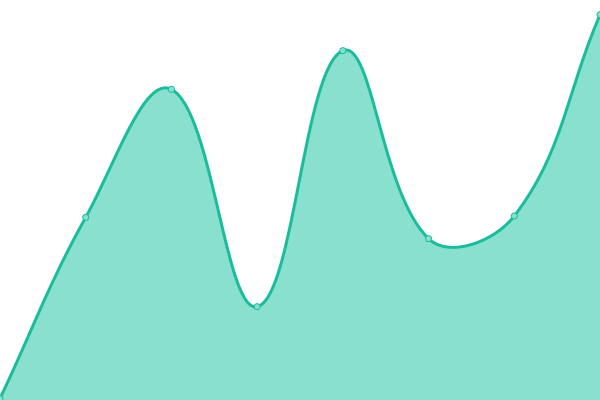
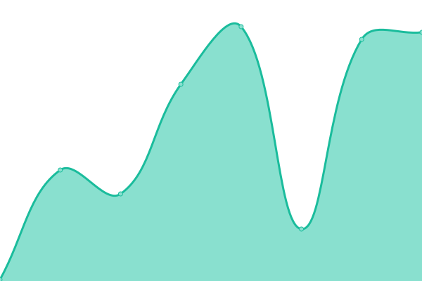
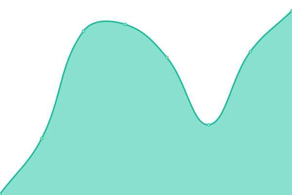
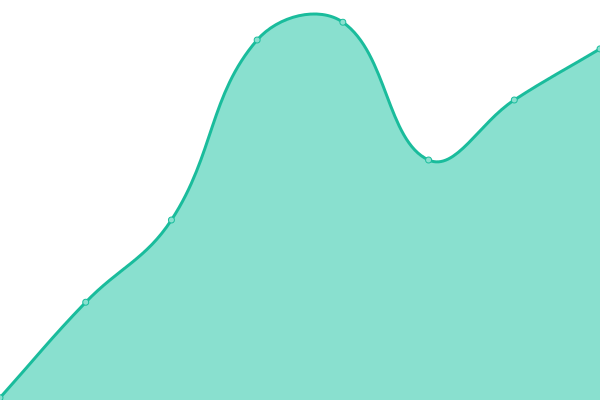

# [📈 Live Status](https://unvernisable.tech): <!--live status--> **🟧 Partial outage**

This repository contains the open-source uptime monitor and status page for [Punithify](https://unvernisable.tech), powered by [Upptime](https://github.com/upptime/upptime).

With [Upptime](https://upptime.js.org), you can get your own unlimited and free uptime monitor and status page, powered entirely by a GitHub repository. We use [Issues](https://github.com/Punithify/Monitor/issues) as incident reports, [Actions](https://github.com/Punithify/Monitor/actions) as uptime monitors, and [Pages](https://unvernisable.tech) for the status page.

<!--start: status pages-->
<!-- This summary is generated by Upptime (https://github.com/upptime/upptime) -->
<!-- Do not edit this manually, your changes will be overwritten -->
<!-- prettier-ignore -->
| URL | Status | History | Response Time | Uptime |
| --- | ------ | ------- | ------------- | ------ |
|  [unvernisable](https://www.unvernisable.tech) | 🟥 Down | [unvernisable.yml](https://github.com/Punithify/Monitor/commits/HEAD/history/unvernisable.yml) | 

 321ms
     
 | 

<a href="https://unvernisable.tech/history/unvernisable">0.00%</a>
    

|  [snippets-quicky](https://snippets-quicky.vercel.app) | 🟩 Up | [snippets-quicky.yml](https://github.com/Punithify/Monitor/commits/HEAD/history/snippets-quicky.yml) | 

 225ms
     
 | 

<a href="https://unvernisable.tech/history/snippets-quicky">99.55%</a>
    

|  [Blog](https://unvernisable.hashnode.dev) | 🟩 Up | [blog.yml](https://github.com/Punithify/Monitor/commits/HEAD/history/blog.yml) | 

 602ms
     
 | 

<a href="https://unvernisable.tech/history/blog">100.00%</a>
    

|  [Pokedex](https://pokedex-rho-steel.vercel.app) | 🟩 Up | [pokedex.yml](https://github.com/Punithify/Monitor/commits/HEAD/history/pokedex.yml) | 

 205ms
     
 | 

<a href="https://unvernisable.tech/history/pokedex">99.56%</a>
    

<!--end: status pages-->

[**Visit our status website →**](https://unvernisable.tech)

## 📄 License

- Powered by: [Upptime](https://github.com/upptime/upptime)
- Code: [MIT](./LICENSE) © [Punithify](https://unvernisable.tech)
- Data in the `./history` directory: [Open Database License](https://opendatacommons.org/licenses/odbl/1-0/)
